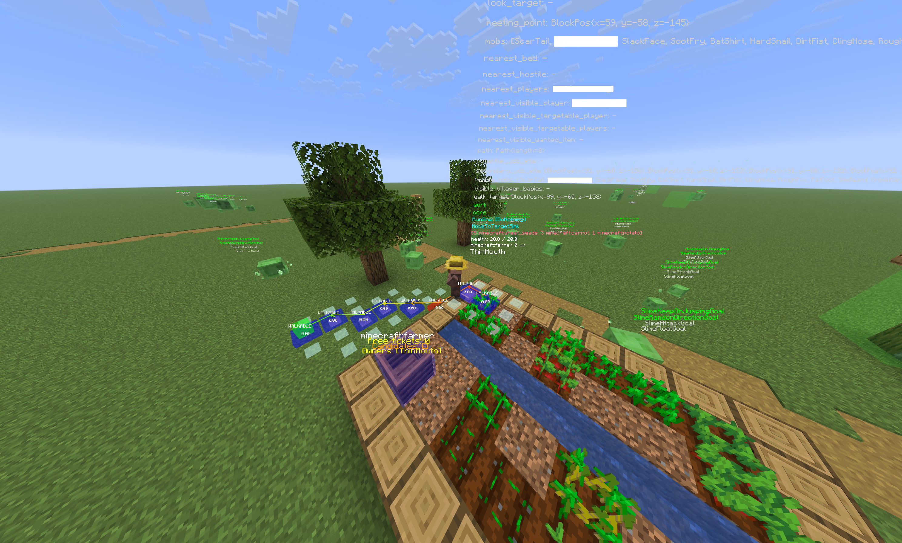

# devflags-fabric



Fabric mod for Minecraft 26.1.2 that unlocks all hidden developer features normally only available inside Mojang's IDE.

Sets `SharedConstants.IS_RUNNING_IN_IDE = true` and `MC_DEBUG_HOTKEYS=true` at class-load time.

---

## Contents

- [Installation](#installation)
- [Important Keybinds](#important-keybinds)
- [Debug Hotkeys (Client)](#debug-hotkeys-client)
- [Server Commands](#server-commands)
- [Always-Available Commands](#always-available-commands)
- [Debug Flags Reference](#debug-flags-reference)
  - [Renderer Overlays](#renderer-overlays)
  - [Gameplay & QOL](#gameplay--qol)
  - [Misc](#misc)
  - [Intentionally Disabled](#intentionally-disabled)
- [Build](#build)

---

## Installation

**Requirements**
- Minecraft **26.1.2**
- [Fabric Loader](https://fabricmc.net/use/installer/) **0.19.2** or later

**Steps**

1. Download the latest `devflags-fabric-*.jar` from the [Releases](../../releases/latest) page.
2. Place the jar in your instance's `mods/` folder:
   - **Prism Launcher** — right-click your instance → *Edit* → *Mods* → *Add from file*, or drop the jar into `<instance>/minecraft/mods/`
   - **Default launcher** — `%APPDATA%\.minecraft\mods\` (Windows) or `~/.minecraft/mods/` (macOS/Linux)
3. Launch Minecraft. No configuration needed — all debug flags are enabled automatically on startup.

> While waiting for Modrinth approval, builds are only available via the Releases page above.

---

## Important Keybinds

`F3 + Z` — Custom debug renderer menu

`F3 + F6` — Mojang internal debug options menu

---

## Debug Hotkeys (Client)

All hotkeys below require F3 to be held. They are unlocked by `MC_DEBUG_HOTKEYS=true` and are handled by `handleChunkDebugKeys` inside `KeyboardHandler`.

> **Note:** F3+F with this mod enabled toggles fog instead of cycling render distance. This is the dev-mode override.

| Hotkey | Action |
|---|---|
| F3+E | Toggle chunk section path debug overlay |
| F3+F | Toggle fog rendering on/off |
| F3+L | Toggle smart culling (`Minecraft.smartCull`) |
| F3+O | Toggle frustum culling octree overlay |
| F3+U | Capture/freeze frustum at current camera position |
| F3+Shift+U | Kill (release) the captured frustum |
| F3+V | Toggle chunk section visibility overlay |
| F3+W | Toggle wireframe rendering mode |

### What frustum capture does

F3+U freezes the view frustum in place. The game continues rendering from your new camera position but only draws chunks/entities that were visible from where you pressed the key. This lets you fly around and observe exactly what the frustum culling algorithm sees.

---

## Server Commands

These commands are registered only when `IS_RUNNING_IN_IDE` is true. All require operator permissions at the level noted.

### `/raid` — Admin
Controls and inspects raid state. Requires a player to be in a valid raid region.

| Subcommand | Description |
|---|---|
| `start [omenlvl]` | Force-start a raid at your position with optional omen level |
| `stop` | Immediately end the active raid |
| `check` | Print current raid status to chat |
| `sound <type>` | Play a raid sound |
| `spawnleader` | Force-spawn a raid captain |
| `setomen <level>` | Override the current omen level |
| `glow` | Toggle glow on all active raiders |

### `/debugpath to <x> <y> <z>` — Gamemaster
Computes and visualizes the pathfinding route from your entity to the given block position. Renders the path in the world and reports whether the target is reachable.

### `/debugmobspawning at <x> <y> <z>` — Gamemaster
Forces the mob spawning evaluation at the specified position and prints the result for each spawn category. Useful for diagnosing why mobs are or aren't spawning.

### `/warden_spawn_tracker` — Gamemaster
Directly reads and writes the warden spawn tracker state for players in range.

| Subcommand | Description |
|---|---|
| `clear` | Reset the warning level for all nearby players |
| `set <warning_level>` | Set warning level to 0–4 on all nearby players |

### `/spawn_armor_trims *_lag_my_game [pattern]` — Gamemaster
Spawns a complete set of armor stands wearing every armor trim combination (all materials × all patterns). The subcommand is intentionally named `*_lag_my_game` — this will tank FPS on large registries.

### `/serverpack push <url> [uuid] [hash]` / `pop` — Gamemaster
Pushes a server resource pack URL to all connected clients, or pops the most recently pushed pack. Useful for testing pack delivery without restarting.

### `/debugconfig config <target>` / `unconfig <target>` — Admin (dedicated server only)
Sends or revokes a dialog config to a specific player by UUID. Used for testing the dialog/screen config system.

---

## Always-Available Commands

These are registered regardless of dev flags.

### `/chase` — Any op
Connects two game instances together so one follows another's camera. Intended for internal Mojang recording/QA sessions.

| Subcommand | Description |
|---|---|
| `lead [bind_address] [port]` | Start leading — other instances can follow you |
| `follow <host> [port]` | Follow another instance's camera |
| `stop` | Disconnect |

### `/test` — Any op
Runs the built-in game test framework. Only `minecraft:always_pass` is present in the public jar — Mojang's internal test suite is not shipped.

```
/test run minecraft:always_pass
```

---

## Debug Flags Reference

Each flag corresponds to a `DebugToggle` property set at startup. Click any flag name for a full description and usage notes. Flags are grouped by the in-game debug menu tab where they appear (`F3 + F6`).

### Renderer Overlays

| Flag | Effect |
|---|---|
| [`MC_DEBUG_PATHFINDING`](docs/flags/pathfinding.md) | Pathfinding route overlay |
| [`MC_DEBUG_NEIGHBORSUPDATE`](docs/flags/neighborsupdate.md) | Block neighbor update overlay |
| [`MC_DEBUG_STRUCTURES`](docs/flags/structures.md) | Structure bounding box overlay |
| [`MC_DEBUG_GAME_EVENT_LISTENERS`](docs/flags/game-event-listeners.md) | Game event listener overlay |
| [`MC_DEBUG_VILLAGE_SECTIONS`](docs/flags/village-sections.md) | Village section overlay |
| [`MC_DEBUG_BRAIN`](docs/flags/brain.md) | Mob brain/memory overlay |
| [`MC_DEBUG_POI`](docs/flags/poi.md) | Point of interest overlay |
| [`MC_DEBUG_BEES`](docs/flags/bees.md) | Bee hive/path overlay |
| [`MC_DEBUG_RAIDS`](docs/flags/raids.md) | Raid state overlay |
| [`MC_DEBUG_GOAL_SELECTOR`](docs/flags/goal-selector.md) | AI goal selector overlay |
| [`MC_DEBUG_EXPERIMENTAL_REDSTONEWIRE_UPDATE_ORDER`](docs/flags/experimental-redstonewire-update-order.md) | Experimental redstone wire update order overlay |
| [`MC_DEBUG_SHAPES`](docs/flags/shapes.md) | Block collision shape overlay |
| [`MC_DEBUG_SHOW_LOCAL_SERVER_ENTITY_HIT_BOXES`](docs/flags/show-local-server-entity-hit-boxes.md) | Entity hitbox overlay (integrated server) |
| [`MC_DEBUG_ENTITY_BLOCK_INTERSECTION`](docs/flags/entity-block-intersection.md) | Entity/block intersection overlay |
| [`MC_DEBUG_BLOCK_BREAK`](docs/flags/block-break.md) | Block break progress overlay |
| [`MC_DEBUG_BREEZE_MOB`](docs/flags/breeze-mob.md) | Breeze mob debug overlay |
| [`MC_DEBUG_SCULK_CATALYST`](docs/flags/sculk-catalyst.md) | Sculk catalyst spread overlay |
| [`MC_DEBUG_LARGE_DRIPSTONE`](docs/flags/large-dripstone.md) | Large dripstone generation overlay |
| [`MC_DEBUG_CARVERS`](docs/flags/carvers.md) | Cave carver debug overlay |
| [`MC_DEBUG_ORE_VEINS`](docs/flags/ore-veins.md) | Ore vein generation overlay |
| [`MC_DEBUG_AQUIFERS`](docs/flags/aquifers.md) | Aquifer placement overlay |
| [`MC_DEBUG_FEATURE_COUNT`](docs/flags/feature-count.md) | Feature placement count overlay |

### Gameplay & QOL

| Flag | Effect |
|---|---|
| [`MC_DEBUG_DEV_COMMANDS`](docs/flags/dev-commands.md) | Enables additional internal dev commands |
| [`MC_DEBUG_VERBOSE_COMMAND_ERRORS`](docs/flags/verbose-command-errors.md) | Full stack traces on command errors in chat |
| [`MC_DEBUG_UNLOCK_ALL_TRADES`](docs/flags/unlock-all-trades.md) | All villager trade tiers unlocked immediately |
| [`MC_DEBUG_IGNORE_LOCAL_MOB_CAP`](docs/flags/ignore-local-mob-cap.md) | Ignore mob cap on integrated server |
| [`MC_DEBUG_OPEN_INCOMPATIBLE_WORLDS`](docs/flags/open-incompatible-worlds.md) | Allow opening worlds from incompatible versions |
| [`MC_DEBUG_ALLOW_LOW_SIM_DISTANCE`](docs/flags/allow-low-sim-distance.md) | Allow simulation distance below the normal minimum |
| [`MC_DEBUG_CHASE_COMMAND`](docs/flags/chase-command.md) | Enables `/chase` camera sync command |
| [`MC_DEBUG_BYPASS_REALMS_VERSION_CHECK`](docs/flags/bypass-realms-version-check.md) | Skip Realms version compatibility check |
| [`MC_DEBUG_TRIAL_SPAWNER_DETECTS_SHEEP_AS_PLAYERS`](docs/flags/trial-spawner-detects-sheep-as-players.md) | Trial spawner treats sheep as players (activation testing) |
| [`MC_DEBUG_VAULT_DETECTS_SHEEP_AS_PLAYERS`](docs/flags/vault-detects-sheep-as-players.md) | Vault treats sheep as players (activation testing) |
| [`MC_DEBUG_KEEP_JIGSAW_BLOCKS_DURING_STRUCTURE_GEN`](docs/flags/keep-jigsaw-blocks-during-structure-gen.md) | Keep jigsaw blocks in place after structure generation |
| [`MC_DEBUG_STRUCTURE_EDIT_MODE`](docs/flags/structure-edit-mode.md) | Structure edit mode — preserves structure blocks in world |
| [`MC_DEBUG_SAVE_STRUCTURES_AS_SNBT`](docs/flags/save-structures-as-snbt.md) | Save structures as SNBT text files instead of NBT |
| [`MC_DEBUG_SHOW_SERVER_DEBUG_VALUES`](docs/flags/show-server-debug-values.md) | Show server-side debug values in F3 overlay |
| [`MC_DEBUG_MONITOR_TICK_TIMES`](docs/flags/monitor-tick-times.md) | Record per-tick timing data |
| [`MC_DEBUG_SUBTITLES`](docs/flags/subtitles.md) | Show subtitle entries for all sounds |
| [`MC_DEBUG_CURSOR_POS`](docs/flags/cursor-pos.md) | Show cursor coordinates in F3 overlay |
| [`MC_DEBUG_SOCIAL_INTERACTIONS`](docs/flags/social-interactions.md) | Show social interaction debug info |
| [`MC_DEBUG_WORLD_RECREATE`](docs/flags/world-recreate.md) | Enable world recreation debug tooling |
| [`MC_DEBUG_PANORAMA_SCREENSHOT`](docs/flags/panorama-screenshot.md) | Enable panorama screenshot capture mode |
| [`MC_DEBUG_FORCE_ONBOARDING_SCREEN`](docs/flags/force-onboarding-screen.md) | Always show the new-player onboarding screen on launch |
| [`MC_DEBUG_DUMP_TEXTURE_ATLAS`](docs/flags/dump-texture-atlas.md) | Dump texture atlases to disk on load |
| [`MC_DEBUG_SYNCHRONOUS_GL_LOGS`](docs/flags/synchronous-gl-logs.md) | Emit GL debug logs synchronously |
| [`MC_DEBUG_JFR_PROFILING_ENABLE_LEVEL_LOADING`](docs/flags/jfr-profiling-enable-level-loading.md) | Enable JFR profiling during level load |
| [`MC_DEBUG_VERBOSE_SERVER_EVENTS`](docs/flags/verbose-server-events.md) | Log server events verbosely |

### Misc

| Flag | Effect |
|---|---|
| [`MC_DEBUG_DONT_SEND_TELEMETRY_TO_BACKEND`](docs/flags/dont-send-telemetry-to-backend.md) | Suppress outbound telemetry to Mojang's backend |
| [`MC_DEBUG_UI_NARRATION`](docs/flags/ui-narration.md) | Debug UI narration/accessibility output |
| [`MC_DEBUG_PREFER_WAYLAND`](docs/flags/prefer-wayland.md) | Prefer Wayland over X11 on Linux (no-op on other platforms) |
| [`MC_DEBUG_VALIDATE_RESOURCE_PATH_CASE`](docs/flags/validate-resource-path-case.md) | Warn on resource path case mismatches |
| [`MC_DEBUG_SHUFFLE_MODELS`](docs/flags/shuffle-models.md) | Randomize model draw order (render pipeline stress test) |
| [`MC_DEBUG_DEFAULT_SKIN_OVERRIDE`](docs/flags/default-skin-override.md) | Override the default player skin |
| [`MC_DEBUG_ACTIVE_TEXT_AREAS`](docs/flags/active-text-areas.md) | Highlight focused text input fields with a debug outline |
| [`MC_DEBUG_SHUFFLE_UI_RENDERING_ORDER`](docs/flags/shuffle-ui-rendering-order.md) | Randomize UI element draw order (stress test) |
| [`MC_DEBUG_RENDER_UI_LAYERING_RECTANGLES`](docs/flags/render-ui-layering-rectangles.md) | Visualize UI layer boundaries |
| [`MC_DEBUG_NAMED_RUNNABLES`](docs/flags/named-runnables.md) | Attach debug names to scheduled runnables |

### Intentionally Disabled

These flags exist in the game but are **not** enabled by this mod because they are destructive or disruptive to normal gameplay.

| Property | Why it's off |
|---|---|
| `MC_DEBUG_DONT_SAVE_WORLD` | World progress is never written to disk |
| `MC_DEBUG_CHAT_DISABLED` | Disables chat entirely |
| `MC_DEBUG_FORCE_TELEMETRY` | Forces telemetry submission |
| `MC_DEBUG_DISABLE_LIQUID_SPREADING` | Liquids freeze in place |
| `MC_DEBUG_DISABLE_FLUID_GENERATION` | No fluid generation during world gen |
| `MC_DEBUG_DISABLE_AQUIFERS` | Aquifers skipped during world gen |
| `MC_DEBUG_DISABLE_SURFACE` | Surface pass skipped during world gen |
| `MC_DEBUG_DISABLE_CARVERS` | Cave carvers skipped during world gen |
| `MC_DEBUG_DISABLE_STRUCTURES` | Structures skipped during world gen |
| `MC_DEBUG_DISABLE_FEATURES` | All features (trees, ores, etc.) skipped |
| `MC_DEBUG_DISABLE_ORE_VEINS` | Ore veins skipped during world gen |
| `MC_DEBUG_DISABLE_BLENDING` | Blending pass skipped during world gen |
| `MC_DEBUG_DISABLE_BELOW_ZERO_RETROGENERATION` | Below-zero retrogen skipped |

---

## Build

```
./gradlew build
```

Output: `build/libs/devflags-fabric-1.0.0.jar`

Copy to your instance's `minecraft/mods/` folder, or use the VS Code task (`Cmd+Shift+B`) which builds and deploys to the "26.1.2 Dev Flags Enabled" Prism instance automatically.
